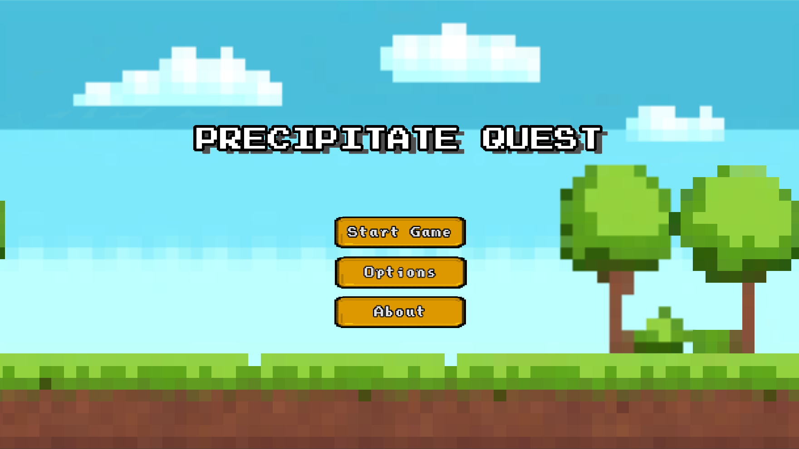
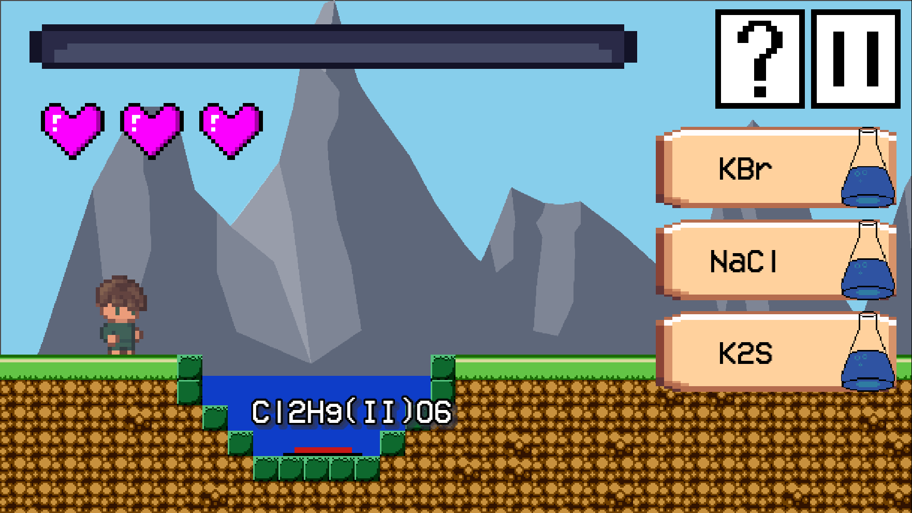

#  Precipitate Quest 
## Description

Precipitate Quest is a point and click game that teaches students about precipitate reactions. The game features levels of varying difficulty, each designed to help students understand how to read a solubility chart and figure out what combinations of chemicals will cause precipitate reactions.

## Expected Impact

The aim of this game is to help students understand how to read a solubility chart and determine which combinations of chemicals will cause precipitate reactions.

## Gameplay

The game is played through itch.io https://turbomair.itch.io/precipitate-quest, or by installing the .exe and .pkg files on the release tab here. It involves a precipitation reaction, which is an exchange reaction with two soluble ionic compounds. An example of this is removing ions from the environment such as Pb2+.

## Screenshots

 

## Technologies Used

The game was developed using the following technologies:
- Godot 4
- Piskel
- Firebase
